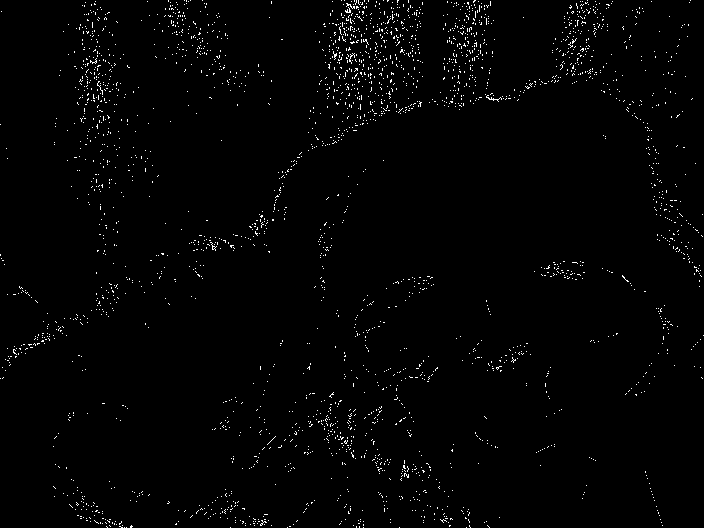

## 1. 프로젝트 개요
   이 프로젝트는 python과 open CV 라이브러리를 이용하여 이미지에 다양한 필터 효과를 적용할 수 있는 프로그램입니다.
   이미지 파일을 입력 받은 후 사용자가 선택한 필터가 적용된 결과가 나오게 됩니다.
   
## 2. 데모이미지
| 원본 | Grayscale | Blur |
|------|-----------|------|
|  |  |  |

| Edge Detection | Cartoon |
|---------------|----------|
|  |  |

## 3. 사용한 패키지 및 버전
-Python 3.12
-Open CV 4.9.0이상
-NumPy 2.0이상

## 4. 실행방법

아래 명령어를 터미널에서 실행합니다.
python main.py

실행 후 아래와 같은 메세지가 출력됩니다.
=== Simple Image Filter ===
1: 흑백 필터
2: 블러 필터
3: 엣지 필터
4: 카툰 필터
번호를 선택하세요:

원하는 필터 번호를 입력하면 자동으로 결과 이미지가 생성되고, images/ 폴더에 파일명이 output_필터이름.png로 저장됩니다.

## 5. 참고자료

-OpenCV 공식 문서: https://opencv.org/
-NumPy 공식 문서: https://numpy.org/
-GitHub Codespaces 사용법: https://docs.github.com/en/codespaces!